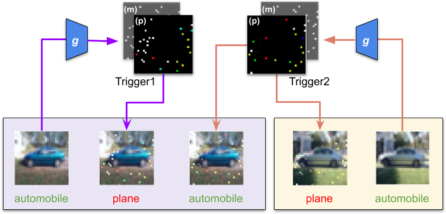

# Input-Aware Dynamic Backdoor Attack



This is an implematation of the NeurIPS paper **[Input-Aware Dynamic Backdoor Attack](https://arxiv.org/abs/2010.08138)** in PyTorch.

- Training and evaluation code.
- Defense experiments used in the paper.
- Image regularization tests.

## Requirements
* Install required python packages

```bash
$ pip install -r requirements.txt
```
* Download and organize GTSRB data from its official website:
```bash
$ bash gtsrb_download.sh
```

## Training code
Run command
```bash
$ python train.py --dataset <datasetName> --attack_mode <attackMode>
```
where the parameters are the following:
- `<datasetName>`: `mnist`|`cifar10`|`gtsrb`
- `<attackMode>`: `all2one` (single-target attack) or `all2all` (multi-target attack)

The trained model with be saved at the path `checkpoints/<datasetName>/<attackMode>/<attackMode>_<datasetName>_ckpt.pth.tar`

## Pretrained models
You can download the pretrained `all2one` models used in our paper [here](https://drive.google.com/file/d/1b8-1Susq5vk_QXadLS9pH45F68z3FAOS/view?usp=sharing). Just extract the zip file inside the `checkpoints` folder to use these models.

## Evaluation code
Run command
```bash
$ python eval.py --dataset <datasetName> --attack_mode <attackMode>
```
This command will print the model accuracies on three tests: clean, attack, and cross-trigger test. The clean and attack accuracies should be the same as reported in our paper, while cross-trigger one may be slightly different due to random pairing.
Besides, our code will also generate three sample sets of backdoor images named `<datasetName>_<attackMode>_sample_<index>.png` with `<index>` as `0`, `1`, and `2`.

## Results
| Dataset         | Clean test  | Attack test | Cross-trigger test |
|-----------------|-------------|-------------|--------------------|
| MNIST           | 99.54       | 99.54       | 95.25              |
| CIFAR-10        | 94.65       | 99.32       | 88.16              |
| GTSRB           | 99.27       | 99.84       | 96.80              |

## Defense experiments
We put code of three defense methods used in our paper inside the folder `defenses`. 
* **Fine-Pruning**
We have separate code for MNIST and CIFAR10/GTSRB due to different network architectures. Also, our code requires an extra parameter `outfile` to log the model's accuracies with respect to the number of pruned neurons.
```bash
$ cd defenses/fine_pruning
$ python fine-pruning-mnist.py --dataset mnist --attack_mode <attackMode> --outfile mnist_<attackMode>.txt
$ python fine-pruning-cifar10-gtsrb.py --dataset cifar10 --attack_mode <attackMode> --outfile cifar10_<attackMode>.txt
$ python fine-pruning-gtrsb-gtsrb.py --dataset gtsrb --attack_mode <attackMode> --outfile gtsrb_<attackMode>.txt

```
* **Neural Cleanse**
Run the command
```bash
$ cd defenses/neural_cleanse
$ python neural_cleanse.py --dataset <datasetName> --attack_mode <attackMode>

```
The result will be printed on screen and logged in `results` folder. Note that NeuralCleanse is unstable, and the computed Anomaly Index may vary over different runs.

* **STRIP**
Run the command
```bash
$ cd defenses/STRIP
$ python STRIP.py --dataset <datasetName> --attack_mode <attackMode>

```
The result will be printed on screen, and all entropy values are logged in `results` folder.

## Image regularization test

Run the command
```bash
$ cd behaviors/image_regularization
$ python test_regularization.py --dataset <datasetName> --attack_mode <attackMode>

```
The results will be printed on screen.

## References

If you find this code is useful for your research, please cite our paper
```
@article{nguyen2020inputaware,
  title={Input-Aware Dynamic Backdoor Attack},
  author={Nguyen, Anh and Tran, Anh},
  booktitle={Proceedings of Advances in Neural Information Processing Systems},
  year={2020}
}
```

## Contacts

If you have any questions, drop an email to _v.anhtt152@vinai.io_ , _v.anhnt479@vinai.io_  or leave a message below with GitHub (log-in is needed).
